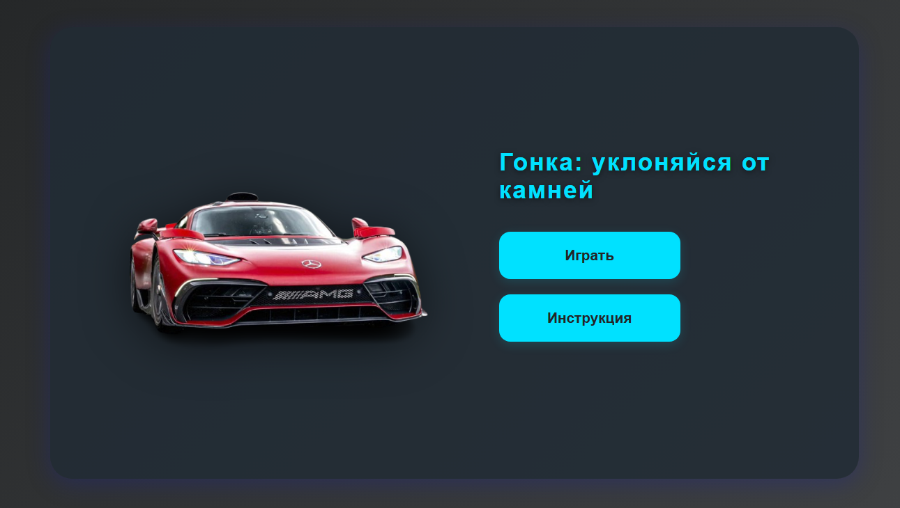

# Гонка: собирай монеты (Car Race: Collect Coins)

**Игра на HTML, CSS и JavaScript.**

## Описание

Простая аркадная игра: управляй машиной, собирай золотые монеты и избегай препятствий (камней).  
Счёт увеличивается за каждую собранную монету.  
Сложность увеличивается с ростом очков: камни появляются чаще и быстрее.

- Управление на компьютере: стрелки ← ↑ → или A/D/W.
- Управление на телефоне: кнопки на экране.

## Как играть

1. Откройте файл `Single_player.html` в браузере.
2. Используйте стрелки или кнопки для управления машиной.
3. Собирайте монеты, избегайте камней.
4. Если столкнётесь с камнем или выйдете за пределы дороги — игра окончена.

## Файлы

- `Single_player.html` — основной файл игры.
- `images/coin.png` — изображение монеты.
- `images/rock.png` — изображение препятствия (камня).
- `sounds/` — папка с аудиофайлами (начало, монета, проигрыш).

## Скриншот

---

# Car Race: Collect Coins

A simple arcade game: control the car, collect coins, avoid rocks.  
Score increases for each coin. Difficulty increases as you progress.

- PC: Use arrow keys or A/D/W.
- Mobile: Use on-screen buttons.

## How to play

1. Open `Single_player.html` in your browser.
2. Use the controls to move the car.
3. Collect coins, avoid rocks.
4. Game over if you hit a rock or leave the road.

---

## License

MIT